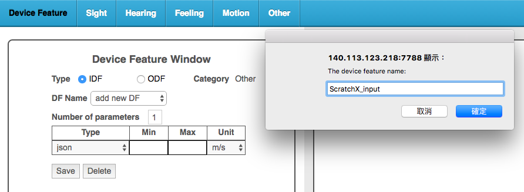
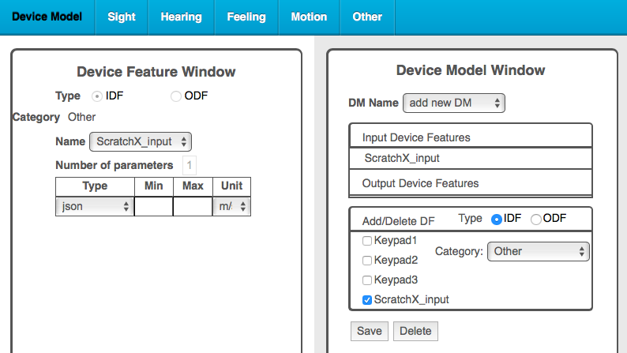

# iottalkDA-scratch document

> Note: not all ScratchX extension are credible  

1. Open [scratchX](http://scratchx.org/)
2. Click `Open Extension URL`
3. paste the extension code's url [https://sunset1995.github.io/snp/extensions/iottalkDA-scratch.js](https://sunset1995.github.io/snp/extensions/iottalkDA-scratch.js)
4. Click `Open`

## Before start
Make sure IoTtalk server has alread created a module called `ScratchX` with one input feature called `ScratchX_input` and one output feature called `ScratchX_output` on your IoTtalk server.  
Note! The name of the module and feature is really important, please make sure that you don't have typo.  

Follow below steps to create IDF `ScratchX_input`, ODF `ScratchX_output`, DM `ScratchX`:  
1. Add new IDF called `ScratchX_input`, make sure min and max column are blank  
      
2. Add new ODF called `ScratchX_output` like above  
3. Click `Device Feature` button on the left top corner in order to switch to module setting page  
4. Click add new DM  
5. Select `ScratchX_input` and `ScratchX_output` then saved  
      

## iottalkDA-scratch extension blocks
- 
    - setting IoTtalk server url as `http://ip:port` and registered ScratchX DA with mac address `mac_addr`
    - if not registered, all other blocks will not work

- 
    - detach device on IoTtalk server

- 
    - update your `ScratchX_input` feature to IoTtalk server
    - the `val` will be converted to string type

- 
    - like above one
    - the `val` will be converted to number type

- 
    - get your `ScratchX_output` feature from IoTtalk server
    - if `ScratchX_output` is not an object(dict in python) or array(list in python), the `key` will be ignored and directly get the val of `ScratchX_output`

You can pretend all blocks described above are blocking.

## Will you flooding http request ??
No, this extension already handle for you.  
More precisely, `update` will only update local *cache*. *cache* will be checked updated or not every **200ms**, issuing `PUT` request only when *cache* updated.  
Also. `get` has a threshold which is **200ms**. Within threshold, you will be given data in *cache* as result.  

## Examples
